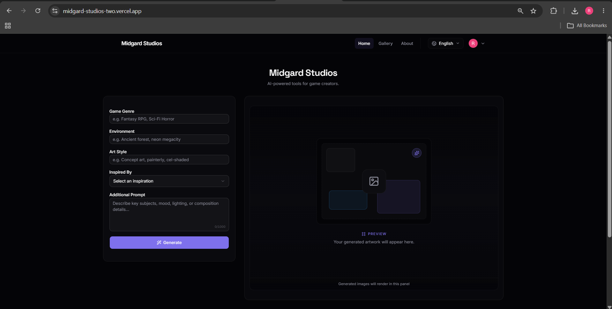
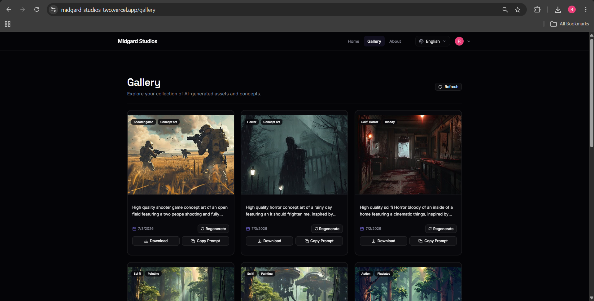
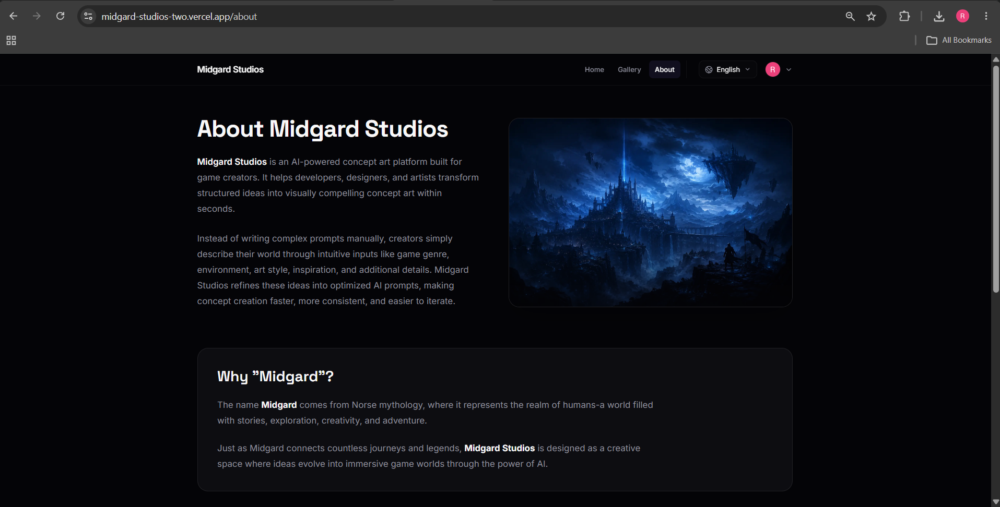
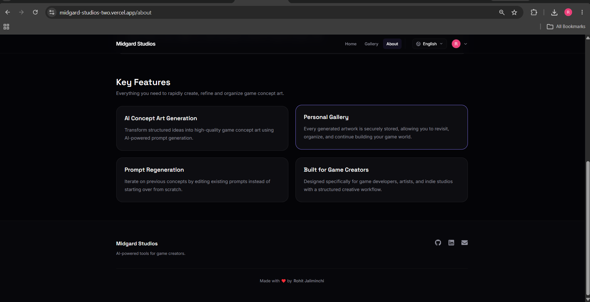

# 🎮 Midgard Studios

> AI-powered game concept art generation platform for game developers, artists, and indie studios.

Midgard Studios transforms structured creative inputs into high-quality AI-generated game concept art. Built as a full-stack application, it provides a complete workflow from prompt generation to cloud storage, user authentication, and a persistent personal gallery.

---

# 🌐 Live Demo

| Service | Link |
|----------|------|
| 🎨 Frontend | https://midgard-studios-two.vercel.app |
| ⚙️ Backend API | https://midgardstudios.onrender.com |

> **Note**
>
> The backend is hosted on Render's free tier. If the service has been inactive, the first request may take **30–60 seconds** while the server wakes up.

---

# 🚀 Quick Start

1. Open the **Frontend** application.
2. Sign in using **Google Authentication**.
3. Enter your game concept.
4. Generate AI artwork.
5. View all creations in your personal gallery.
6. Download or regenerate any previous artwork.
7. Switch between **English 🇺🇸** and **Japanese 🇯🇵** at any time.

---

# ✨ Features

- 🎨 AI-powered game concept art generation
- 🎮 Structured game-focused prompt builder
- 🔒 Google Authentication
- 🖼️ Personal user gallery
- 🔄 Regenerate existing concepts
- ☁️ Cloudinary image hosting
- 🗄️ Neon PostgreSQL persistence
- 🌐 English & Japanese localization
- 📥 Download generated artwork
- 📋 Copy prompt functionality
- 📱 Fully responsive interface
- ⚠️ Graceful error handling
- 🚀 Modern full-stack architecture

---

# 📸 Screenshots

## 🏠 Home



---

## 🖼️ Gallery



---

## ℹ️ About





---

## 🌐 Japanese Localization


---

# 🏗️ System Architecture

```text
                Next.js Frontend
                        │
                        ▼
                Express Backend API
                        │
                        ▼
              Prompt Construction
                        │
                        ▼
             Pollinations AI API
                        │
                        ▼
              Generated Image URL
                        │
                        ▼
            Download Image Buffer
                        │
                        ▼
               Cloudinary Storage
                        │
                        ▼
          Neon PostgreSQL (Prisma)
                        │
                        ▼
                User Gallery
```

---

# 🚀 Tech Stack

## Frontend

- Next.js 15
- React
- TypeScript
- Tailwind CSS
- Shadcn UI
- Auth.js
- next-intl
- React Icons

---

## Backend

- Node.js
- Express.js
- TypeScript
- Prisma ORM

---

## Database

- Neon PostgreSQL

---

## AI

- Pollinations AI

---

## Storage

- Cloudinary

---

## Authentication

- Google OAuth
- Auth.js

---

# 📂 Project Structure

```text
midgard-studios/

├── frontend/
│   ├── app/
│   ├── components/
│   ├── hooks/
│   ├── i18n/
│   ├── lib/
│   ├── messages/
│   └── public/
│
├── backend/
│   ├── prisma/
│   ├── src/
│   │   ├── config/
│   │   ├── controllers/
│   │   ├── middleware/
│   │   ├── repositories/
│   │   ├── routes/
│   │   ├── services/
│   │   ├── types/
│   │   └── utils/
│   │
│   └── generated/
│
└── docs/
```

---

# 🔄 Request Flow

```text
User

↓

Frontend

↓

Express Backend

↓

Prompt Builder

↓

Pollinations AI

↓

Generated Image

↓

Download Image

↓

Cloudinary Upload

↓

Prisma ORM

↓

Neon PostgreSQL

↓

Frontend

↓

Personal Gallery
```

---

# 🎯 How It Works

The user provides:

- Game Genre
- Environment
- Art Style
- Inspiration
- Additional Prompt

The backend constructs an optimized prompt before sending it to Pollinations AI.

Once the image is generated:

1. The backend downloads the image.
2. The image is uploaded to Cloudinary.
3. Image metadata is stored in Neon PostgreSQL.
4. The Cloudinary URL is returned to the frontend.
5. The artwork appears in the user's personal gallery.

---

# 🌍 Localization

Midgard Studios currently supports:

- 🇺🇸 English
- 🇯🇵 Japanese

Language switching happens instantly without affecting application state.

---

# 🔒 Authentication

Authentication is implemented using Google OAuth through Auth.js.

Every authenticated user receives:

- Personal gallery
- Private generation history
- Persistent cloud storage
- Secure session management

---

# ⚠️ Error Handling

The application gracefully handles:

- AI generation failures
- Pollinations timeout
- Network failures
- Cloudinary upload failures
- Database errors
- Missing authentication
- Invalid API responses

Meaningful loading indicators and user-friendly error messages are displayed throughout the application.

---

# 🛠️ Environment Variables

## Backend

```env
PORT=

NODE_ENV=

DATABASE_URL=

GOOGLE_API_KEY=

CLOUDINARY_CLOUD_NAME=

CLOUDINARY_API_KEY=

CLOUDINARY_API_SECRET=

FRONTEND_URL=
```

---

## Frontend

```env
AUTH_SECRET=

AUTH_GOOGLE_ID=

AUTH_GOOGLE_SECRET=

NEXT_PUBLIC_API_URL=
```

---

# 💻 Running Locally

## Clone Repository

```bash
git clone https://github.com/rohit220604/MidgardStudios.git
```

---

## Backend

```bash
cd backend

npm install

npx prisma generate

npx prisma migrate deploy

npm run dev
```

---

## Frontend

```bash
cd frontend

npm install

npm run dev
```

---

Visit:

```text
Frontend:
http://localhost:3000

Backend:
http://localhost:3001
```

---

# 🎨 Design Decisions

Instead of building a generic AI image generator, Midgard Studios focuses specifically on **game concept art**.

Structured prompt inputs guide users through the creative process while improving prompt consistency and reducing prompt engineering effort.

Cloudinary stores generated artwork, while Neon PostgreSQL stores only metadata, allowing the system to scale efficiently.

Authentication ensures every user has a dedicated and private gallery.

All AI communication happens through the backend to keep integrations secure and prevent exposing implementation details to the client.

---

# ⚠️ Known Limitations

- Pollinations AI generation time varies depending on server load.
- AI-generated outputs are non-deterministic.
- Image quality depends on prompt specificity.
- First backend request may be slower due to Render free-tier cold starts.

---

# 🚀 Future Improvements

- Prompt version history
- AI prompt enhancement
- Multiple AI providers
- Public artwork sharing
- Collections
- Favorites
- Team workspaces
- Higher-resolution image generation
- Real-time generation progress

---

# 👨‍💻 Author

**Rohit Jaliminchi**

- GitHub: https://github.com/rohit220604
- LinkedIn: https://www.linkedin.com/in/rohit-jaliminchi-98555224b/
- Email: rjrohit2264@gmail.com

---
